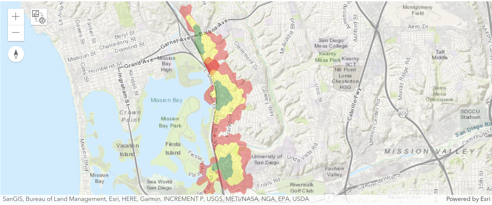
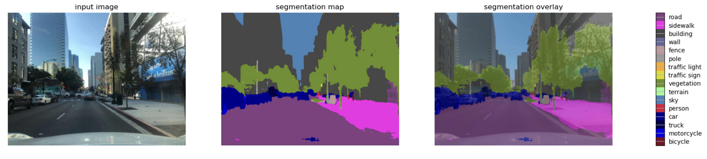
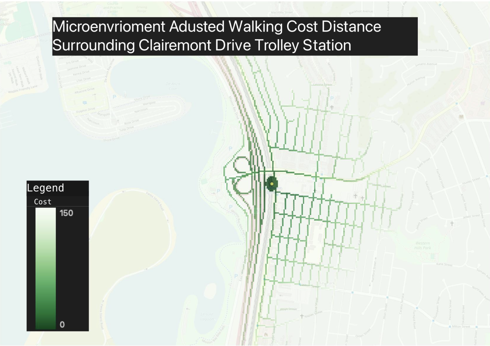
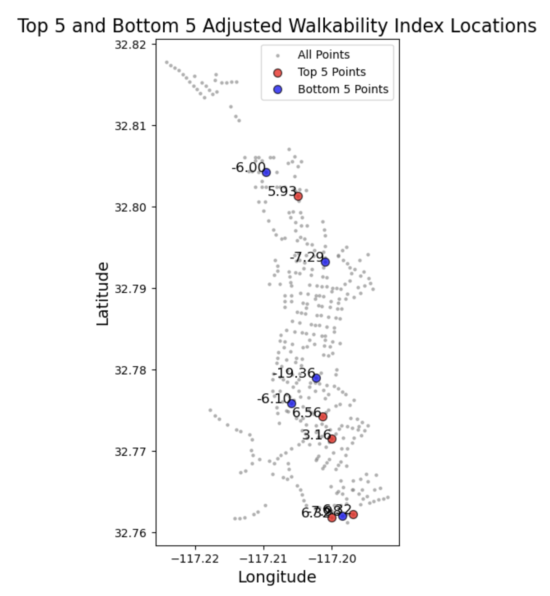

# From Trolley Stops to Walkable Blocks: Machine Learning Insights into San Diego’s Urban Fabric

## Overview
This project analyzes walkability around trolley stations in downtown San Diego, leveraging machine learning techniques on street-level imagery. The goal is to enhance urban planning by identifying areas with varying levels of walkability using methods like semantic segmentation and spatial analysis. The full jupyter notebook for this project can be accessed [here](final_script.ipynb). Due to the size limitations of GitHub, you need to download the layers folder, which contains the necessary shapefiles to run the script, which can be accessed [here](https://drive.google.com/drive/folders/1va1CB1Mpu3_ARyzBV6BOG20ov8-rxumj?usp=sharing). Additionally, the project can also be found in the [UCSD's ArcGIS collection](https://ucsdonline.maps.arcgis.com/home/item.html?id=1ac5990dab0847a7aa9d5414c47b145c).

## Contributors
- [Farrel Azhar](https://www.linkedin.com/in/farrel-azhar-6b8179236/)
- [Daniel Pryke](https://www.linkedin.com/in/danielpryke/)
- [Drew Suthipongchai](https://www.linkedin.com/in/peeyapatr/)

## Abstract
The study integrates spatial analysis with visual classification techniques to assess and enhance urban walkability around trolley stops in downtown San Diego. Using Google Street View images, we perform network analysis to define catchment areas and evaluate walkability based on various factors.

## Background and Methodology
Our methodology draws from key literature on urban walkability and includes several datasets:

1. **Sidewalk Inventory Polyline Dataset**: Provides representations of sidewalks, including their condition and construction year.
   
2. **Google Street View Static API**: Used to scrape street-level imagery for visual walkability analysis, processed with a semantic segmentation model.

3. **ROAD_ALL Dataset**: Comprehensive roadway information crucial for analyzing pedestrian routes and accessibility.

### Identifying Study Area with Network Analysis
We conducted a walking distance network analysis for three trolley stations: **Balboa Avenue Transit Center**, **Clairemont Drive**, and **Tecolote Road**. Catchment areas were defined based on **5-minute**, **10-minute**, and **15-minute** walking distances, focusing on the **10-minute interval** for practical walking times.



### Image Scraping with Google API
We scraped street-level imagery around trolley stations using the Google Static Street View API, downloading images at over 400 unique points. About 900 high-quality images were retained for analysis.


#### Image Download Function

```python
def download_images(lat, lng, prefix):
    """Download street view images if available."""
    headings = [0, 90, 180, 270]  # North, East, South, West
    downloaded_files = []
    start_time = time.time()  # Record the start time
    for heading in headings:
        filename = os.path.join(input_directory, f"{prefix}_heading_{heading}_lat_{lat}_lon_{lng}.jpg")
        params = {
            "size": "1080x1080",  # Max resolution for the free tier
            "location": f"{lat},{lng}",
            "heading": heading,
            "key": API_KEY
        }
        response = requests.get("https://maps.googleapis.com/maps/api/streetview", params=params)
        if response.status_code == 200:
            with open(filename, 'wb') as f:
                f.write(response.content)
            downloaded_files.append(filename)
        else:
            print(f"Failed to download image at {lat}, {lng} with heading {heading}")
    end_time = time.time()  # Record the end time
    duration = end_time - start_time  # Calculate the duration
    print(f"Time taken to download images for point ({lat}, {lng}): {duration:.2f} seconds")
    return downloaded_files
```
### DeepLab Model Visualization

This section demonstrates how to run the DeepLab model on a sample image and visualize the segmentation results. The following code snippet loads a sample image, performs segmentation using the model, and displays the results.

```python
SAMPLE_IMAGE = 'mapilary.jpeg'

print('Running DeepLab on the sample image...')

def run_visualization(SAMPLE_IMAGE):
    """Inferences DeepLab model and visualizes result."""
    original_im = Image.open(SAMPLE_IMAGE)
    seg_map = MODEL.run(original_im)
    vis_segmentation(original_im, seg_map)

run_visualization(SAMPLE_IMAGE)
```
### Sample Output Image


### Adjusted Walkability DataFrame
The final DataFrame created from the semantic segmentation of street images includes various adjusted factors impacting walkability:

<div style="overflow-x: auto; max-width: 800px;">
  <table>
    <thead>
      <tr>
        <th>adjusted_street_greenery</th>
        <th>adjusted_visual_enclosure</th>
        <th>adjusted_dh_ratio</th>
        <th>adjusted_obstacles</th>
        <th>adjusted_visual_complexity</th>
        <th>adjusted_sidewalk</th>
        <th>geometry</th>
        <th>adjusted_walkability_index</th>
      </tr>
    </thead>
    <tbody>
      <tr>
        <td>1.731673</td>
        <td>0.239006</td>
        <td>-0.801196</td>
        <td>-0.602550</td>
        <td>0.0</td>
        <td>-0.338766</td>
        <td>POINT (-117.21786 32.77504)</td>
        <td>0.228166</td>
      </tr>
      <tr>
        <td>2.071793</td>
        <td>0.161678</td>
        <td>-1.272547</td>
        <td>-0.406234</td>
        <td>0.0</td>
        <td>0.660505</td>
        <td>POINT (-117.21705 32.77436)</td>
        <td>1.215196</td>
      </tr>
      <tr>
        <td>1.756792</td>
        <td>0.208461</td>
        <td>-0.954633</td>
        <td>-0.575025</td>
        <td>0.0</td>
        <td>-0.700005</td>
        <td>POINT (-117.21648 32.77395)</td>
        <td>-0.264410</td>
      </tr>
      <tr>
        <td>-0.065953</td>
        <td>0.353069</td>
        <td>0.800694</td>
        <td>-0.286263</td>
        <td>0.0</td>
        <td>-1.040573</td>
        <td>POINT (-117.21420 32.76170)</td>
        <td>-0.239025</td>
      </tr>
      <tr>
        <td>2.015237</td>
        <td>0.223784</td>
        <td>-0.521862</td>
        <td>-0.560223</td>
        <td>0.0</td>
        <td>-0.504752</td>
        <td>POINT (-117.21332 32.76740)</td>
        <td>0.652184</td>
      </tr>
      <tr>
        <td>...</td>
        <td>...</td>
        <td>...</td>
        <td>...</td>
        <td>...</td>
        <td>...</td>
        <td>...</td>
        <td>...</td>
      </tr>
    </tbody>
  </table>
</div>

### Data Analysis
Using QGIS, we conducted raster analysis to visualize and quantify walkability. We created cost-distance maps that reveal how walkability scores correlate with accessibility to trolley stations. These maps also highlight significant trends, such as the disparity in walkability between gridded neighborhoods and cul-de-sacs.



## Key Findings
The adjusted walkability index indicates critical insights about urban fabric and infrastructure around trolley stations. For example, the **Clairemont Drive Trolley Station** demonstrates notably poor walkability, which reduces its effective catchment area. Conversely, neighborhoods designed with a gridded layout tend to exhibit higher walkability scores, emphasizing the role of urban design in facilitating pedestrian movement.

## Visual Insights
### Top and Bottom 5 Adjusted Walkability Index Locations
The following plot illustrates the geographic locations of the top 5 and bottom 5 adjusted walkability index points in downtown San Diego:



## Discussion
The results underscore the necessity for targeted urban planning interventions. Our analysis provides a replicable framework for assessing urban walkability, making it a valuable resource for city planners and policymakers. Future research should focus on validating these findings through ground-truthing and expanding the geographic scope of the study to include additional trolley stations.

## Conclusion and Future Work
This project not only sheds light on walkability around San Diego's trolley stations but also sets the stage for future explorations in urban planning. Potential next steps include:
- Validating model predictions with real-world observations.
- Utilizing higher-resolution imagery for enhanced analysis accuracy.
- Expanding the study to include more trolley stations for a comprehensive urban assessment.

## License
This project is licensed under the MIT License - see the [LICENSE](LICENSE) file for details.

## Acknowledgments
We appreciate the support and contributions from our team members and the valuable datasets provided by various sources.
